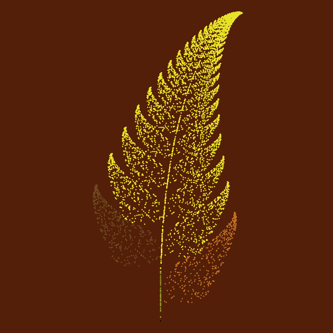

# Barnsley Fractal
<p align="center">
    <picture>
      <source 
        srcset="assets/barnsley_dark.png"
        media="(prefers-color-scheme: dark)"
      />
      
    </picture>
  </p>


This repository contains a high level implementation of a visualization of well known fractal named as "Barnsley Fractal" aka "Barnsley Fern", written in `Python`.

## Features
*   Ability to easily alter the,
      * Total number of points to plot
      * Plot speed (+ additional ultraspeed mode)
      * colors of the segments of the plot
      * canvas background color
      * ...
      * and many more...
      
*   Optional Notification when ploting completed.
*   Automatically saving your preferences. Can Reset at anytime.
*   Exporting result as a PNG image.


 Specialities of this implementation are,
*   Simple implementation but supports many **features**.
*   Single python file so **portable**.
*   Runnable **without any thirdparty dependancy**. <sup>_(Additional Dependency required only to export the results.)_<sup/>
* Complete documentation

## Quick Links

1.  [Getting Started](#getting-started)
2.  [Feature configuration](#feature-configuration)
    * [Using the Commandline for basic preferences](#using-the-commandline)
    * [Through `preferences_barnsley.json`](#creatingediting-the-preferences_barnsleyjson)
3.  [What is Barsnley Fractal?](#what-is-barnsley-fractal)
    * [Mathematical Foundations](#mathematical-foundations)
    * [Visual Charasteristics](#visual-characteristics)
    * [Applications](#applications)
4.  [For what?](#for-what)
5.  [Gallery](#gallery) 
6.  [Contributions](#contributions)
  
## Getting Started

1.  Clone the repository
    ```bash
    $ git clone https://github.com/chathura-de-silva/Barnsley-Fractal.git
    ```
2.  Install Python Pillow package.
    ```bash
    $ pip install Pillow==10.0.1
    ```
3. cd in to the repository root.

4.  Run the python script. (This will plott the fern with default parameters. See the [Feature Configuration](#feature-configuration) section for more specifications. )
    ```bash
    $ python barnsley_fractal.py
    ```
>[!IMPORTANT]<br>
> * `Python version 3.12` or later recommended.
> * `Python Pillow` is optional and only needed if you wish to export the plot as an image file.
## Feature Configuration  


You can configure the preferences in two ways.
1.  [Using the Commandline.](#using-the-commandline)
2.  [Creating/Editing the `preferences_barnsley.json`](#creatingediting-the-preferences_barnsleyjson)


### Using the Commandline
While _**some of the advanced parameters are only could be set by using the above mentioned second method**_, most of the important parameters can be easily altered using commandline. Everything you alter will be saved and retained when you plot the fern next time.

What you have to do is, use below parameters when running the script.
Each time you run the script with commandline arguments as specified below your preferred alteration will get saved.(step 4 in [getting started](#getting-started))

* Enable ultraspeed ploting mode. Recommended when the number of points to plot is set high (Enabled by default)
  ```bash
  $ python barnsley_fractal.py -u
  ```
* Enable Slow mode and optionally set a speed. This disables ultrafast mode.
  * Enable slow mode with saved/default speed.
    ```bash
    $ python barnsley_fractal.py -s
    ```
  * Enable slow mode and set speed to _"`speed`" (speed : 0 to 10)._
     ```bash
    $ python barnsley_fractal.py -s speed
    ```
* Setting the number of points to plot as _"`n`" (n : positive integer)._ 
  ```bash
  $ python barnsley_fractal.py -p n
  ```

* Exports the plot as a PNG file at the end of ploting.
  ```bash
  $ python barnsley_fractal.py save
  ```
* Altering the plot colors
  * You can specify any permutation of the parameters given below as given in the examples. Color is specified as RGB hex values prefixed with "#". 
    * `bs` -  color of the stem (base)
    * `tp` -  color of the successively smaller leaflet (top)
    * `ll` -  color of the larger left leaflet (left leaflet)
    * `rl` -  color of the larger right leaflet (right leaflet)


  ex - 
  *  ```bash
      $ python barnsley_fractal.py -c bs#123456
      ```
  *  ```bash
      $ python barnsley_fractal.py -c tp#123456 lf#ffffff bs#6bf231
      ```
* Reset preferences
  ```bash
  $ python barnsley_fractal.py reset
  ```
### Creating/Editing the `preferences_barnsley.json`.

* If you have atleast once run the project using any additional commandline argument you would be able to find the JSON file inside the project root with your previous alterations. 
* Otherwise you can copy the one below and create a JSON file there named `preferences_barnsley.json` parameters or, just run the project with `reset` argument once and locate the JSON created by the script in the root and edit it accordingly.

* JSON file with alterable parameters and their default values
  ```json
  {"ultrafast": true, 
    "x_offset": 0, 
    "y_offset": -230, 
    "scale": 50, 
    "plot_points": 10000, 
    "probabilities": [0.01, 0.85, 0.07, 0.07], 
    "x": 0, 
    "y": 0, 
    "speed": 0, 
    "leftleaf_color": "#6E4C21", 
    "rightleaf_color": "#37B469", 
    "base_color": "#988a4f", 
    "top_color": "#788511", 
    "completion_message": null, 
    "background_color": "black", 
    "save_image": false, 
    "point_size": 1,
    "use_dot_points": false}
  ```
- `ultrafast` (Boolean): Set to `true` for ultra-fast plotting mode, which speeds up the generation process.

- `x_offset` (Integer): Adjusts the horizontal position of the fern relative to the center of the display.

- `y_offset` (Integer): Adjusts the vertical position of the fern relative to the center of the display.

- `scale` (Integer): Scales the size of the fern. Larger values result in a bigger fern, while smaller values result in a smaller one.

- `plot_points` (Positive integer): Specifies the number of points to plot when generating the fern. Higher values produce more detailed ferns.

- `probabilities` (Array of 4 Floats between 0 and 1 that adds up to 1 ): A list of four probabilities that control the likelihood of selecting different transformation functions. The four values correspond to the four transformation functions used in generating the fern. Changing this may completely change the plot.

- `x` (Float): Initial x-coordinate of the starting point for plotting the fern.

- `y` (Float): Initial y-coordinate of the starting point for plotting the fern.

- `speed` (Integer between 0 and 10): Controls the drawing speed of the turtle graphics. Set to a positive integer to adjust the speed.

- `leftleaf_color`, `rightleaf_color`, `base_color`, `top_color` (Color hashes): Hexadecimal color codes (e.g., "#6E4C21") that specify the colors of different parts of the fern. You can customize these colors to change the appearance of the fractal.

- `completion_message` (String or null): An optional completion message that can be displayed upon generating the fern. Set to `null` if you don't want a completion message.

- `background_color` (Color hash): Specifies the background color of the canvas.

- `save_image` (Boolean): Set to `true` if you want to save the generated image as a PNG file. This allows you to keep a copy of the fern image.

- `use_dot_points` (boolean): Decide whether to plot the points with a circle or a dot. By default set to `false` and hence circles are being drawn.
  >[!NOTE]
  >*  Using dot points results in a bump in plotting speed. So set this to `true` with ultraspeed mode to get the maximum possible speed.

- `point_size` (positive float*): Controls the size of the plotted points. A smaller value results in smaller points.
  >[!IMPORTANT]
  >* 2 <= `point_size` <= 5 if `use_dot_points` = `true`
  >* 0.02 <= `point_size` <= 5 if `use_dot_points` = `false`
  >*  Otherwise the point size will be reset to the infimum.
## What is Barnsley Fractal?


The **Barnsley Fractal**, also known as the **Barnsley Fern**, is a fascinating and visually striking fractal pattern that was discovered by British mathematician and computer scientist Michael Barnsley in 1988. This fractal is renowned for its intricate, fern-like appearance and is a prominent example of an iterated function system (IFS) fractal.

### Mathematical Foundations

The Barnsley Fractal is generated through a series of mathematical transformations applied to a single point in the complex plane (usually referred to as the "seed" or "initial point"). These transformations are defined by a set of four affine transformations, each with an associated probability:

1. **Stem Transformation:** 
   - Probability: 1%
   - Transformation:
     - x' = 0
     - y' = 0.16y

2. **Successively Smaller Leaflet Transformation:**
   - Probability: 85%
   - Transformation:
     - x' = 0.85x + 0.04y
     - y' = -0.04x + 0.85y + 1.6

3. **Larger Left Leaflet Transformation:**
   - Probability: 7%
   - Transformation:
     - x' = 0.2x - 0.26y
     - y' = 0.23x + 0.22y + 1.6

4. **Larger Right Leaflet Transformation:**
   - Probability: 7%
   - Transformation:
     - x' = -0.15x + 0.28y
     - y' = 0.26x + 0.24y + 0.44
> [!NOTE]
> Respectively above 4 functions and there transformations denoted inside those functions are named as function1,function2,...and (x1,y1), (x2,y2),... in the implementation.  

These transformations are applied iteratively to the initial point, with the selection of each transformation determined by its associated probability. As the iterations progress, they give rise to the intricate self-replicating patterns that characterize the Barnsley Fractal.

### Visual Characteristics

The Barnsley Fractal exhibits a stunning resemblance to a fern or leaflet, with numerous smaller leaflets branching out from a central stem. The fern's intricate and detailed structure emerges as more iterations are applied. The self-similarity of the pattern is evident, as each smaller leaflet resembles the entire fern, only on a different scale.

### Applications

The Barnsley Fractal is not only a beautiful mathematical curiosity but also finds practical applications in computer graphics, as it serves as an excellent example of a complex fractal structure generated by a relatively simple mathematical algorithm. Artists and computer programmers often use it to create visually appealing natural-looking patterns and landscapes.

In summary, the **Barnsley Fractal**, discovered by Michael Barnsley, is a remarkable example of an iterated function system (IFS) fractal. Its intricate fern-like structure is generated through a set of four affine transformations with associated probabilities. This fractal has found applications in both mathematics and computer graphics, and its beauty lies in its ability to showcase the power of mathematical transformations in creating intricate and visually captivating patterns.

## For What?

I developed this project earlier for a presentation called `Math in Nature`. It was a hardcoded basic implementation. Recently I decided to improve it by adding additional features to alter the plot and make it open source with complete documentation as I found that there seem to be no any flexible and simple implementations of the barnsley fern with complete documentation. And here it is! I got some other implementations too. Mayby I will upload them later just like this.

You could use this for,
* Demonstrations of the fractal in any context, like in math.
* As a simple python project to learn as a beginner.
* To explore and identify the patterns of barnsley fractal
* or just to play around and have some fun.


##  Gallery

 |  |
:-------------------------:|:-------------------------:|:-------------------------:
  |  |
  |  |

## Contributions
* Any contribution is welcome. Even an implementation of a new fractal would be appreciated.
* Use the discussions for any clarification.
* Open an issue,
  *  if you face any problems while setting up or using and you think that it's a fault in the implementation.
  * For any feature request.

[go to the top](#barnsley-fractal)
